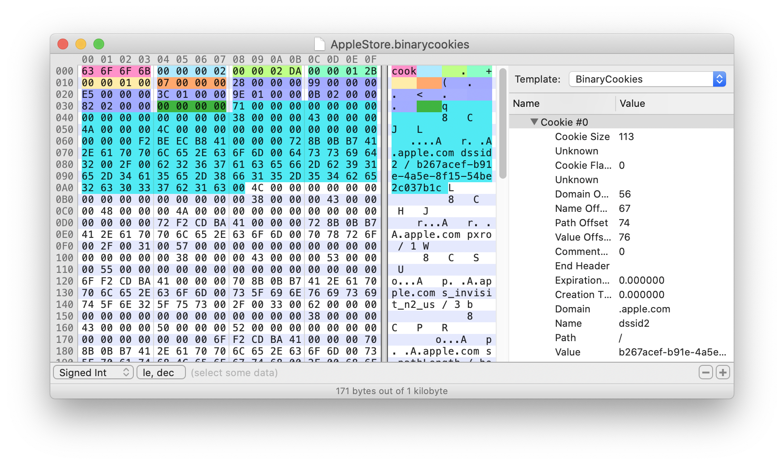

# Binary Cookies

Go (golang) implementation of an encoder and decoder for the Binary Cookies file format used by Safari and other applications based on WebKit to store HTTP cookies. A CLI program is also included to allow you to inspect and manipulate the binary cookies from the commodity of your Terminal.



## Usage

If you are going to use this Go module in your project:

```sh
go get github.com/cixtor/binarycookies
```

If you want to install the command line interface (CLI):

```sh
go get github.com/cixtor/binarycookies/cmd/binarycookies
```
